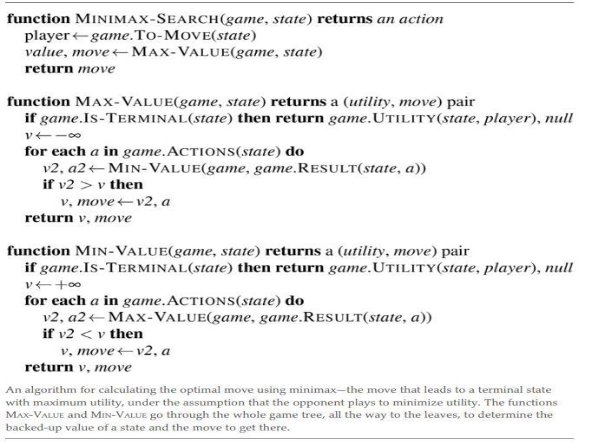
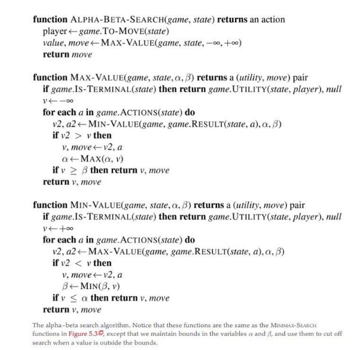
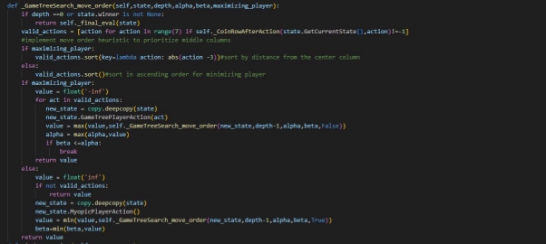

19 

Programming Assignment 2 

In partial fulfillment of the course Artificial Intelligence (CS F407) Submitted to Prof. Sujith Thomas 

Name – VIDHAN AGARWAL ID – 2020B3A71857G 

TABLE OF CONTENTS 

1. Acknowledgements                                       page -3   
1. Introduction                                                   page-4 
1. Methodology                                                 page-4 
1. Choice of Evaluative function                      page-7 
1. PART A                                                             page-10 
1. PART B                                                             page-13 
1. PART C                                                             page-15 
1. PART D                                                             page-17 
1. References                                                      page-19 

ACKNOWLEDGEMENTS 

The completion of the undertaking could not have been without the participation and assistance of some people.  

Their contributions are sincerely appreciated and gratefully acknowledged. I would like to express my deep appreciation and indebtedness, particular to Professor Sujith Thomas for giving the assignment and helping in clearing some doubts which came during the assignment.  

Above all, to the great almighty, the author of knowledge and wisdom for his countless love. 

` `Thank you. 

CONNECT FOUR 

INTRODUCTION 

The program assignment requires playing against a Myopic player that looks only one move ahead before choosing the best action. 

The task given to us is to write a program that uses Game Tree based search to play against the Myopic player and beat it. The Game tree-based program should look 5 moves ahead (the cutoff depth is 5) 

The Myopic player always makes the first move. Myopic player is player 1 and Game tree player is player 2. 

METHODOLOGY 

The game of connect four is a Two-player zero-sum game as the game is deterministic , two-player, turn-taking with perfect information and there is no win-win situation present. Since one player is trying to maximize the utility and the other player is trying to minimize it we will use the MINIMAX search algorithm initially to play the game. Where myopic player is the one minimizing the utility and game tree player tries to maximize it. 

Furthermore, we will use alpha beta pruning to cut large parts of the tree that makes no difference to the outcome.  

For this classic game of Connect Four there are 4,531,985,219,092 positions for all game boards populated with 0 to 42 pieces hence searching all possible moves becomes complex so we will also have a cut off depth and evaluation function to determine the position of the player in terms of win and lose condition and give a score. So we will replace the utility function with our own evaluative function which gives the expected utility at that depth in our algorithm. 

CHOICE OF EVALUATION FUNCTION 

Thinking of an effective evaluation function for a game like Connect Four involves considering various factors that contribute to the position’s desirability. Here are few choices of evaluations which I considered in this assignment. 

**Note:**  **If any of the players have won then a high negative or a high positive value is attached to the score** 

**Note:** Ignore the values for state. Winner in the following codes.  **Basic Function: Count Player’s pieces** 

The state of the game is decided by the number of pieces belonging to the Myopic and the Game Tree Player. A higher count for the Game Tree player might indicate a more favorable position. 

**Center Control: Favor the Center Columns** 

This function gives more weight to pieces placed in the center columns, as controlling the center often provides strategic advantages. Here if the game tree player has higher number of center pieces than the myopic player then a higher score is returned asserting dominance of game tree player.  

**Connectivity: Encourage Connected pieces** 

We will award points for having connected pieces, as connected pieces are more likely to lead to victory. 

**Threat Detection: Identify Potential Wins** 

Evaluate based on the number of potential winning moves for each player. “game tree threats” is calculated by counting the number of potential winning moves (threats) for the Game Tree Player (Player 2). It iterates over each column in the top three rows (range **(**3**)**) and checks if there is a piece belonging to the Game Tree Player in that column. If so, it increments the count. Similarly for myopic threats and the difference is returned.  

**Defense: Discourage opponent threats** 

Penalize the player for allowing potential winning moves by the opponent. ”myopic Défense**”** is calculated by counting the number of potential winning moves (threats) for the Myopic Player in the bottom three rows of the board (rows with indices 3, 4, and 5), similar is done for game tree defence and the difference is returned. 

**Weighted Sum: Power of all strategies** 

Finally, I used a combination of different aspects mentioned above and made a final evaluation function which is the weighted combination of all the functions mentioned above (the weights are subject to change in further sub parts). 

PART A: COMPARISON OF EVALUATION FUNCTIONS IN MINI-MAX ALGORITHM 

**For depth =5** 

|Function type |Total time (50 games) |Average win moves |` `Wins |
| - | - | - | - |
|Basic Function |114\.866 |25\.90909 |22 |
|Centre Control |201\.8766 |24\.7142 |35 |
|Connectivity |110\.657 |28\.08 |26 |
|Threat Detection |508\.0987 |26\.303 |33 |
|Defense |440 |25\.3 |30 |
|Weighted Sum |963\.607 |26\.3 |40 |

The above table shows the comparison between the different evaluation function based on the total time in seconds and the average number of moves before win and the number of wins. 

Total Time

1200 1000 800 600 400

200 0

Basic FunctionCentre Control Connectivity Threat Defense Weighted Sum

Detection

The total time taken by each function in all 50 games is based on the complexity of the evaluation function, the depth and the branches which it visited. Since we are only concerned about the evaluation function in this part, we can see that the basic function and the connectivity function had very low complexity as the logic for calculating the score was very straight forward and hence the program overall took very less time to find good moves and win some games, the complexity increased gradually and became more strategic as we moved towards the center control, threat detection and defense functions. The weighted function being the weighted average of all the functions took the most time as it used the combined power of all the functions to calculate the score. 

Average Number of moves

29 28 27 26 25 24 23

Basic FunctionCentre Control Connectivity Threat Defense Weighted Sum

Detection

Average Wins

45 40 35 30 25 20 15 10 5 0

Basic FunctionCentre Control Connectivity Threat Defense Weighted Sum

Detection

From the above two graphs it was clear that basic function and connectivity were not as good as the rest of the functions as these two functions were simply just calculating number of connected pieces and the number of pieces so the average wins for both the functions were quite less and the average number of moves were also dissatisfactory given that they 

win very less time. The threat and defense functions giving high number of wins but the average number of moves before winning were also quite large, the good part is that the algorithm was strategizing and strategizing proved to give better results and more win against the myopic player as compared to the basic functions which weren’t using any strategy. The best function among all was the center evaluation function which was using the idea of center domination and it proved to be the better one among the other functions as it gave good number of wins and the average number of moves were also less. Moreover, it took less time as compared to the other evaluation functions. Hence to include all the strategies and some basic functions I took the weighted average of all the evaluation functions giving weight to the center evaluation the most followed by threat and defense which was followed by the basic functions. It was found that it gave 40+ wins out of 50 games played and the average number of moves before each win was also not large! So, the final eval function (code given above) was the best function at the cost of time.   

PART B: ALPHA-BETA PRUNING AND COMPARISON OF EVALUATIVE FUNCTIONS Below is the table for alpha beta pruning at depth =3 

Even at depth of 3 the functions were showing similar results as it showed for minimax algorithm which suggests that the wins do not change when we try to prune the branches because the parts which were not in used are only pruned while the rest are the same. 

The only exception was the mysterious behavior of connectivity function as the number of wins were decreased significantly which is attributed to the fact that at low depth there will seldom be any positions which will have 4 connected components together of the same color hence the evaluation function becomes weak at low depth. 

Hence according I changed my weighted sum to decrease the weight of the connectivity function as given below. I also gave the defense function a less weight to a similar reason as the results of average wins were less pleasing and even the average number of moves. Hence even now the best function was the “final\_eval” function but again at the cost of time. 

As compared to the minimax algorithm even at depth =3 it was able to give results at a lesser time because unwanted parts of the game tree were pruned even at such less cut off depth. The graph for the same is shown below. 

Total time for depth =3

90 80 70

60 50 40 30 20 10 0

Basic Function Centre Control Connectivity Threat Defense Weighted Sum

Detection

Minimax Alpha beta pruning

However, the average number of moves and the wins remained the same because pruning is used for speeding up the program and removing unwanted parts. 

For depth = 5 the alpha beta pruning gave the following results 

The table for minimax function is already given in the part a of the assignment. When the depth of the algorithm was increased, the speed was largely decreased! Because this time the algorithm had quite a few unwanted branches which it can prune. The graph below shows a visual depiction of the same. 

Total time for depth = 5 

1200 1000 800 600 400 200 0

Basic Centre Connectivity Threat Defense Weighted Function Control Detection Sum

Minimax Alpha beta pruning

Hence alpha beta pruning greatly reduces the time for the algorithm to compute the same results. 

PART C:  MOVE ORDERING HEURISTICS AND ITS COMPARISON 

The move order heuristic is implemented to improve the efficiency of the Minimax algorithm, one of the common move orders is to prioritize the moves that are more likely to lead to cut – offs. In this game we can start with the middle columns as these are strategically more important which also seen from our center evaluation function which gave more score to center capture and yielded good results. Below is the code for the same. Alpha-beta pruning was also implemented to improve the speed and reduce unwanted branches.  

Below is the chart for the results based on different evaluation functions. 

Total time for depth =5

1200 1000 800 600 400 200 0

Basic Function Centre Control Connectivity Threat Detection Defense Weighted Sum

Minimax Alpha beta pruning Move Order

As seen above in all the evaluation functions the total time for computing results of the 50 games were reduced in move order heuristics which obviously states that the average time is reduced it is because we are prioritizing the strategic moves which is the actions taken in the middle columns specifically so the time taken to compute the results decreased considerably which also says the number of recursive calls have also decreased. There is however an exception in center control evaluation in which the number for pruning and move order is same which might be because the evaluation function is itself focused on giving high scores to middle columns.  

To measure the total number of recursive calls in 50 games I introduced a global variable “recursive\_calls”. Since every game’s recursive call will depend on the moves played by both sides, it was found out that the recursive calls decreased when we applied move order heuristics and compared it with the alpha beta pruning algorithm. This was because the move order heuristics prioritizes some strategic actions which leads to a smaller number of visits in other branches because the actions which are taken first in move order turn out to have better results which leads to pruning the rest part and we also do not need to visit the parts which yield results which are not as good as the current one. The reason for decrease in time is because of the decrease in the number of recursive calls too.  

Recursive Calls for depth =5 

6000 5000 4000

3000 Alpha beta pruning

Move Order

2000

1000

0

Defense Weighted Sum

PART D: Impact of cut off depth of frequency of wins and average moves before win 

Increasing the cut off depth in the algorithm leads to a stronger player because it allows the algorithm to explore the game tree to a greater depth, considering more potential moves in the deeper parts of the game at the cost of complexity as the branching factor of the game tree grows exponentially with depth. 

Time taken

1000 900 800 700 600 500 400 300 200 100 0

Basic Function Centre Connectivity Threat Defense Weighted Control Detection Sum

depth =5 depth=3

As seen in the chart due to more branching the time taken by depth=5 is more than time taken than depth=3. 

The reason for the better performance is the player can make more informed decisions based on a deeper exploration of possible moves. The AI has better chances of winning with an increased cut-off depth since it can make more optimal moves which is given below in the chart. 

Frequency of Wins

45 40 35 30 25 20 15 10 5 0

Basic FunctionCentre Control Connectivity Threat Defense Weighted Sum

Detection

depth =5 depth=3

However, for average number of moves before the wins might or might not lead to deciding quickly the winning or losing positions since the evaluation function is only that strong enough to decide in a certain number of thresholds moves who is the winner the average number of moves before the win might be less or more or equal for varying level of depths. The chart for the same is given below. 

Average Number of Moves

28 27 26 25

24 23

22

Basic Function Centre Control Connectivity Threat Detection Defense Weighted Sum depth =5 depth=3

REFERENCES 

- Wikipedia 
- Artificial Intelligence a modern approach 
